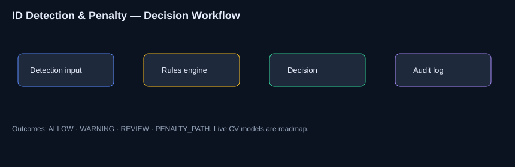

<div align="center">

# ID Detection & Penalty Workflow

### Production-style Automation Application · Rules · Audit Logging

[](https://www.python.org/)
[](Dockerfile)
[](LICENSE)

**Amaragani Nikhil Sai** · Portfolio automation system  
Simulated detection scenarios today; OpenCV/YOLO-ready interface for later.

</div>

---

## Problem

Identity checks need consistent, auditable outcomes when IDs are present, missing, or uncertain.

---

## Solution

A **production-style automation application**: detect → apply policy rules → emit decision → write audit log.

---

## Features

- Pluggable detection interface  
- Confidence-aware rules  
- Decisions: ALLOW / WARNING / REVIEW / PENALTY_PATH  
- SQLite audit trail  
- Docker + CI  

---

## Architecture



---

## Tech stack

Python · rules engine · SQLite · Docker · pytest  
Roadmap: OpenCV / YOLO, alerts, policy YAML

---

## Folder structure

```text
src/ tests/ docs/ data/ images/ scripts/ config/
Dockerfile docker-compose.yml requirements.txt
```

---

## Installation

```bash
git clone https://github.com/nikhilamaragani-jpg/id-detection-and-penalty-mechanism.git
cd id-detection-and-penalty-mechanism
pip install -r requirements.txt
```

---

## Usage

```bash
python src/main.py
pytest -q
docker compose up --build
```

---

## Project workflow

1. Detection result (simulated or model)  
2. Rules evaluation  
3. Decision emission  
4. Audit persistence  

---

## Screenshots

[images/architecture.svg](images/architecture.svg) · capture CLI multi-case output to `images/cli_demo.png`

---

## Results

Multi-scenario demo shows policy behavior across confidence bands. Live camera CV not claimed.

---

## Future improvements

- [ ] YOLO/OpenCV adapter  
- [ ] Human review queue  
- [ ] Metrics on false-positive cost  

---

## Skills demonstrated

Workflow design · policy thinking · modular interfaces · auditability · CV integration planning

---

## Documentation

[PROJECT_BRIEF](docs/PROJECT_BRIEF.md) · [DEMO](docs/DEMO.md) · [INTERVIEW](docs/INTERVIEW.md) · [RESUME_BULLETS](docs/RESUME_BULLETS.md)

## License

MIT · **Author:** Amaragani Nikhil Sai · https://nikhilamaragani-jpg.github.io/
