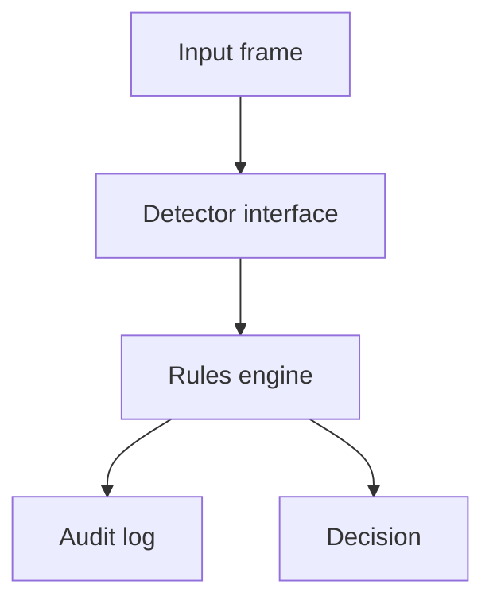

<div align="center">

# ID Detection & Penalty Workflow

### Computer Vision-Ready Architecture · Rules Engine · Audit Logging

[](https://www.python.org/)
[](Dockerfile)
[](LICENSE)

**Portfolio automation system** by [Amaragani Nikhil Sai](https://github.com/nikhilamaragani-jpg)  
Runnable decision workflow with simulated detection. Live OpenCV/YOLO models are roadmap — not claimed deployed.

</div>

---

## Problem

Identity checks need **consistent outcomes** when IDs are present, missing, or unclear. Ad-hoc decisions lack audit evidence and are hard to extend with real vision models later.

---

## Solution

A modular **detect → rules → decide → audit** pipeline:

- Pluggable detection interface (simulated scenarios today)  
- Confidence-aware penalty / review rules  
- SQLite audit log for every decision  
- Multi-case demo for interviews  

---

## Features

- Separation of sensing vs policy  
- Outcomes: ALLOW · WARNING · REVIEW · PENALTY_PATH  
- Audit logging  
- Docker demo  
- Unit tests for rules  

---

## Architecture

```text
Image / detection input
        |
        v
Detection module (interface + simulated scenarios)
        |
        v
Rules / penalty engine → ALLOW | WARNING | REVIEW | PENALTY_PATH
        |
        v
Logging layer (SQLite audit)
```



---

## Tech stack

| Area | Technology |
|------|------------|
| Language | Python 3 |
| Decisioning | Rules engine |
| Storage | SQLite |
| Vision | Interface ready for OpenCV / YOLO (roadmap) |
| Packaging | Docker |

---

## Folder structure

```text
.
├── README.md
├── LICENSE
├── requirements.txt
├── Dockerfile
├── docker-compose.yml
├── src/
│   ├── main.py
│   ├── detector.py
│   ├── rules.py
│   └── database.py
├── tests/
├── docs/
├── data/
└── images/
```

---

## Installation

```bash
git clone https://github.com/nikhilamaragani-jpg/id-detection-and-penalty-mechanism.git
cd id-detection-and-penalty-mechanism
pip install -r requirements.txt
```

---

## Usage

```bash
python src/main.py
pytest -q
docker compose up --build
```

---

## Project workflow

1. Receive detection result (real or simulated)  
2. Apply confidence thresholds / presence rules  
3. Emit decision  
4. Persist audit row  

---

## Screenshots

Capture multi-case CLI output → `images/demo.png` (see `images/README.md`).

---

## Results

| Item | Status |
|------|--------|
| Multi-scenario simulation | Implemented |
| Rules + audit log | Implemented |
| Live camera + YOLO | Roadmap |
| Alert channels (email/SMS) | Roadmap |

---

## Future improvements

- [ ] OpenCV / YOLOv8 detector adapter  
- [ ] Human-in-the-loop review UI  
- [ ] Policy config YAML  
- [ ] Metrics on false positive cost  

---

## Skills demonstrated

Workflow design · policy thinking · modular interfaces · auditability · CV integration planning · Docker

---

## Documentation

[PROJECT_BRIEF](docs/PROJECT_BRIEF.md) · [DEMO](docs/DEMO.md) · [INTERVIEW](docs/INTERVIEW.md) · [RESUME_BULLETS](docs/RESUME_BULLETS.md) · [ABOUT_TOPICS](docs/ABOUT_TOPICS.md)

## License

MIT

**Author:** Amaragani Nikhil Sai · https://nikhilamaragani-jpg.github.io/
