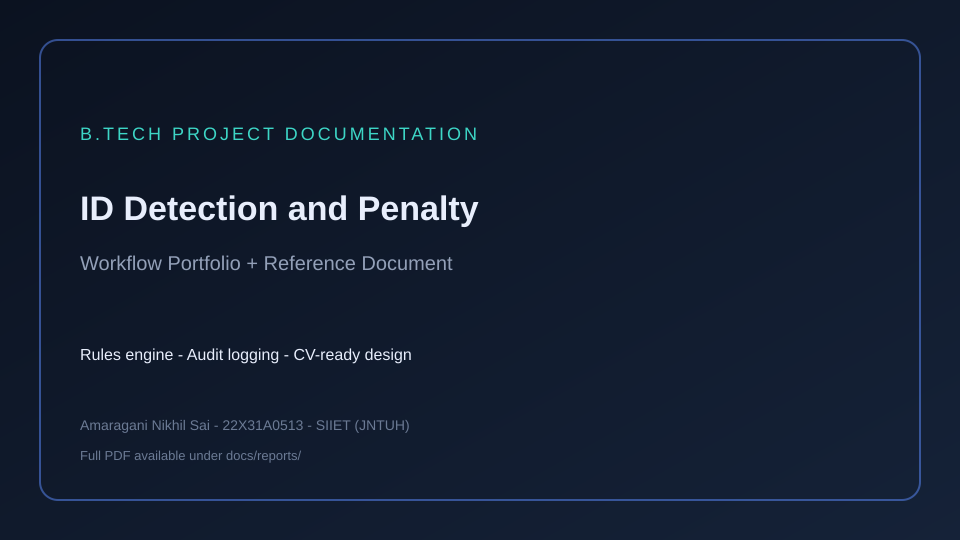

<div align="center">

# ID Detection & Penalty Mechanism

### B.Tech Project · Rules Engine · Audit Logging · CV-ready Design

[](https://www.python.org/)
[](Dockerfile)
[](LICENSE)

**Amaragani Nikhil Sai** · B.Tech CSE · SIIET (JNTUH)

Simulated detection today; OpenCV/YOLO-ready interface later.  
Academic themes: [docs/REPORT_SUMMARY.md](docs/REPORT_SUMMARY.md)

</div>

---




## Problem

ID checks need consistent, auditable outcomes when identity documents are present, missing, or unclear — and policy responses (warnings, review, penalties) must be structured.

---

## Solution

Modular pipeline: **detection interface → rules / penalty engine → decision → SQLite audit log**.

---

## Architecture


---

## Tech stack

Python · rules engine · SQLite · Docker · pytest  
Roadmap: OpenCV / YOLO, camera loop, alerts

---

## Installation & usage

```bash
git clone https://github.com/nikhilamaragani-jpg/id-detection-and-penalty-mechanism.git
cd id-detection-and-penalty-mechanism
pip install -r requirements.txt
python src/main.py
pytest -q
```

---

## Documentation

[REPORT_SUMMARY](docs/REPORT_SUMMARY.md) · [PROJECT_BRIEF](docs/PROJECT_BRIEF.md) · [DEMO](docs/DEMO.md) · [INTERVIEW](docs/INTERVIEW.md) · [RESUME_BULLETS](docs/RESUME_BULLETS.md)

## License

MIT · **Author:** Amaragani Nikhil Sai · https://nikhilamaragani-jpg.github.io/

### Academic report PDF

- **Reference PDF:** [docs/reports/ID_Detection_and_Penalty_Reference_Document.pdf](docs/reports/ID_Detection_and_Penalty_Reference_Document.pdf)

