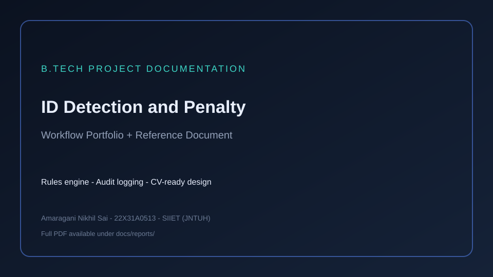
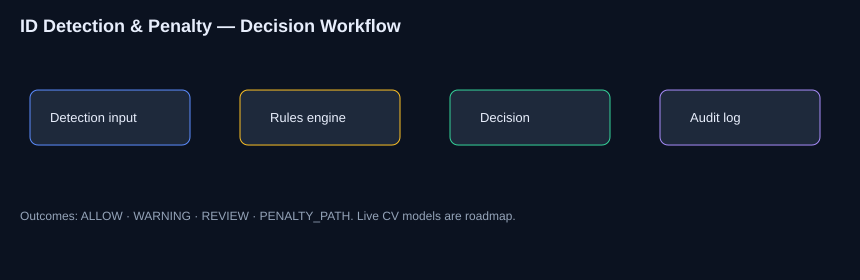

<div align="center">

# ID Detection & Penalty Mechanism

### B.Tech Project · Review-First Rules · SQLite Audit · Data Analytics

[](https://www.python.org/)
[](Dockerfile)
[](LICENSE)

**Amaragani Nikhil Sai** · B.Tech CSE · SIIET (JNTUH)

Transparent simulation today; OpenCV/YOLO adapter is future work.
Academic themes: [docs/REPORT_SUMMARY.md](docs/REPORT_SUMMARY.md)

</div>

---




## Problem

ID checks need consistent, auditable outcomes when identity documents are present, missing, or unclear — and policy responses (warnings, review, penalties) must be structured.

---

## Solution

Modular pipeline: **detection adapter → review-first policy → decision → SQLite audit log → analytics summary**.

The included detector explicitly reports **unavailable**; it does not inspect images or claim a detection. Simulated scenarios demonstrate the workflow. Missing or uncertain detections require human review and never trigger an automatic penalty.

---

## Architecture



---

## Tech stack

Python · rules engine · SQLite · pytest · Docker
Roadmap: real detector integration, camera loop, alerts

---

## Installation & usage

```bash
git clone https://github.com/nikhilamaragani-jpg/id-detection-and-penalty-mechanism.git
cd id-detection-and-penalty-mechanism
pip install -r requirements.txt
python src/main.py
pytest -q
```

The demo appends synthetic events to `data/detections.db` and prints aggregate detection, decision, confidence, and daily-volume metrics. Set `ID_DETECTION_DB_PATH` to choose a different database file. Re-running the demo appends another set of events.

---

## Documentation

[PROJECT_BRIEF](docs/PROJECT_BRIEF.md) · [DATA_DICTIONARY](docs/DATA_DICTIONARY.md) · [REPORT_SUMMARY](docs/REPORT_SUMMARY.md) · [DEMO](docs/DEMO.md) · [INTERVIEW](docs/INTERVIEW.md) · [RESUME_BULLETS](docs/RESUME_BULLETS.md)

## License

MIT · **Author:** Amaragani Nikhil Sai · https://nikhilamaragani-jpg.github.io/

### Academic report PDF

- **Reference PDF:** [docs/reports/ID_Detection_and_Penalty_Reference_Document.pdf](docs/reports/ID_Detection_and_Penalty_Reference_Document.pdf)
