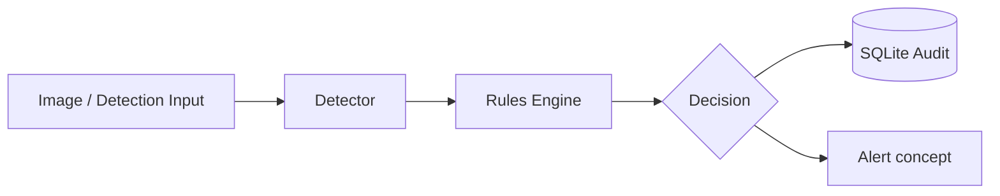

# Demo Walkthrough — ID Detection & Penalty

```text
Detection result received
Rules engine decision: ALLOW / WARNING / PENALTY
Decision logged to SQLite for audit
```


```mermaid
flowchart LR
  IN[Image / Detection Input] --> DET[Detector]
  DET --> RULES[Rules Engine]
  RULES --> DEC{Decision}
  DEC --> LOG[(SQLite Audit)]
  DEC --> ALERT[Alert concept]
```
