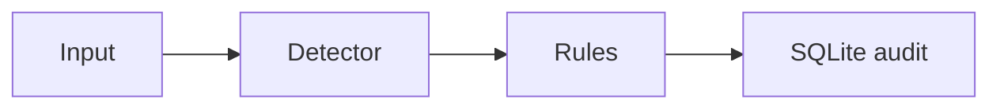

# Demo walkthrough

```bash
pip install -r requirements.txt
python src/main.py
```

```text
--- Case: Valid ID present ---
Decision: ALLOW ...
--- Case: Missing / unclear ID ---
Decision: PENALTY_PATH / REVIEW ...
Logged: yes (SQLite)
```


